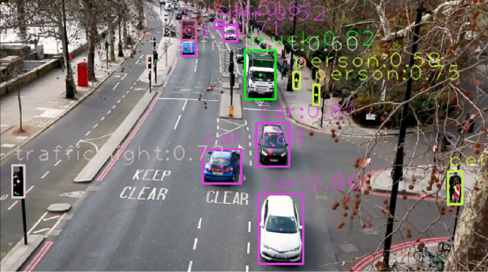

# ROS-yolov7_ObjectDetector
This is a ROS package developed for **object detection in ROS topic images**. It's based on yolov7 detectors and you can also use custom models if you want. The available weights are **pt files** and **trt files**.

<div align="center">
    <a href="./">
        
    </a>
</div>

**Subscribe :** Image

**Publish :** bbox, Image with bbox


## Preferences
we tested in
**ROS melodic** and **ROS noetic** (recommand).

``` shell
# clone to the ros catkin workspace
git clone https://github.com/IoRTKETI/ROS-yolov7-ObjectDetector

# catkin make
cd ~/(your ros workspace PATH) && catkin_make

```


If you want publishing only bbox (not publishing Image with bbox).
``` shell
# ./yolov7/scripts/yolov7_object_detection.py
# line 26
self.img_pub_flag = False
```

If your subscribed topic is different.
``` shell
# ./yolov7/scripts/yolov7_object_detection.py
# line 29
subscribing_image_topic = '(your subscribed topic)'
```


## Run
``` shell
# use roslaunch
roslaunch yolov7 yolov7_object_detection.launch

or

# use rosrun
roscore

# another terminal
rosrun yolov7 yolov7_object_detection.launch
```


## Use custom data

**Add weight file :** ./yolov7/scripts/classifier/yolov7_visdrone.pt(custom file)

**Add yaml file :** ./yolov7/config/yolov7_visdrone_detection.yaml(custom file)

**Change yaml file path in python file :**
``` shell
# ./yolov7/scripts/yolov7_object_detection.py
# line 22
self.yaml_file = 'yolov7_visdrone_detection.yaml' # (custom file)
```
